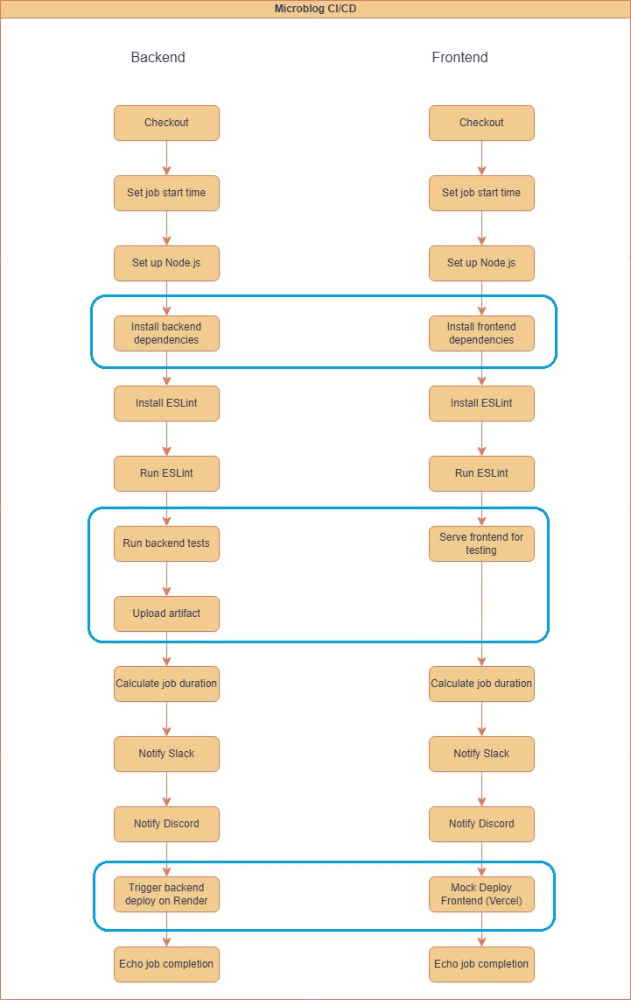
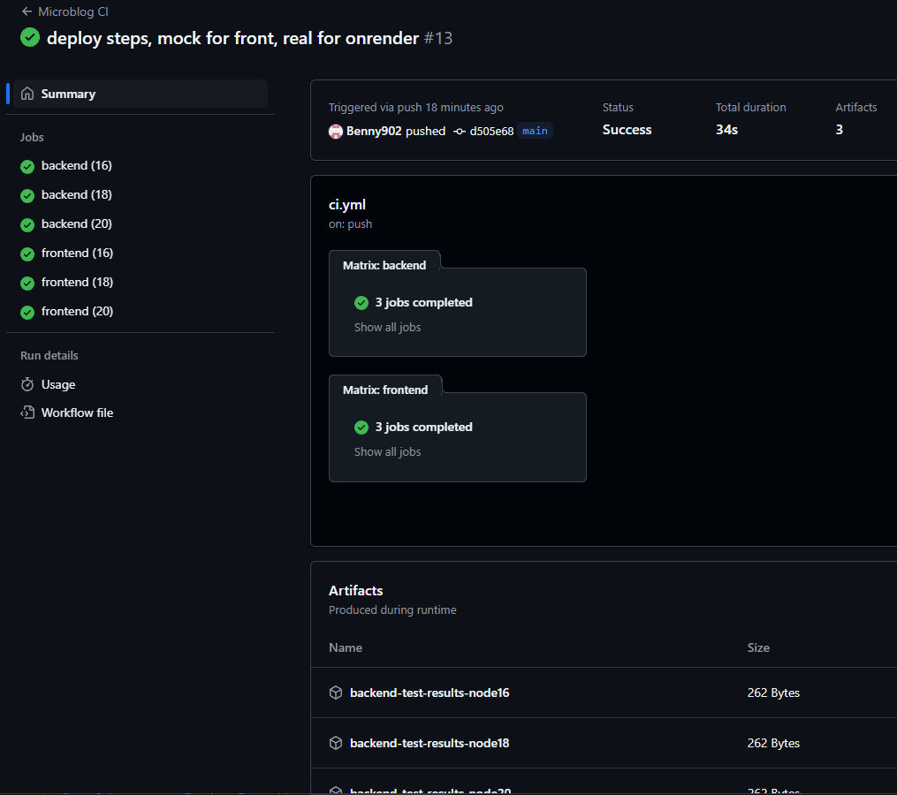
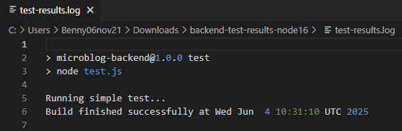
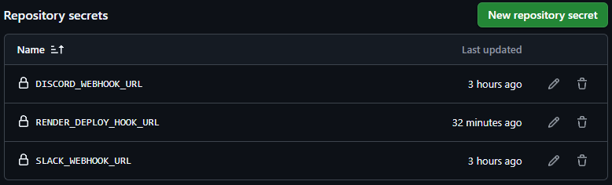
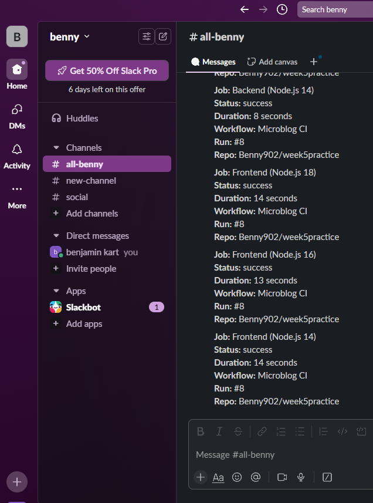
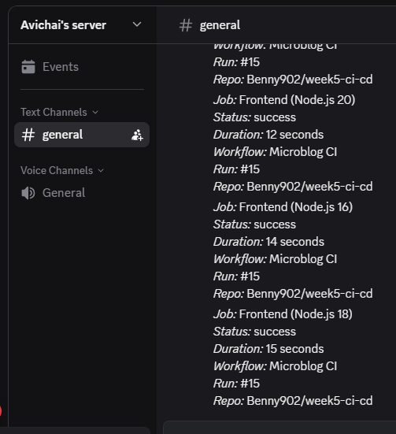
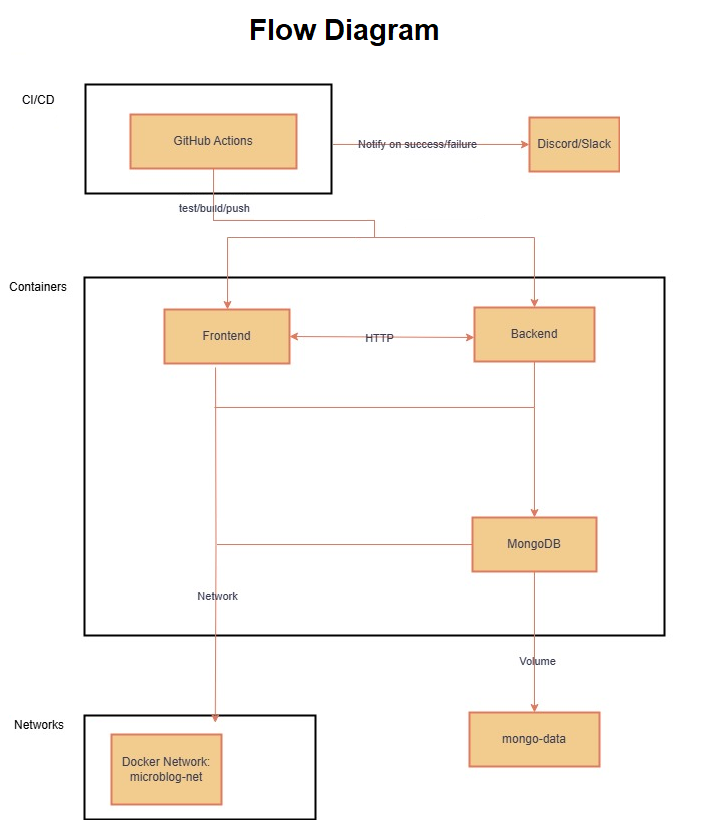
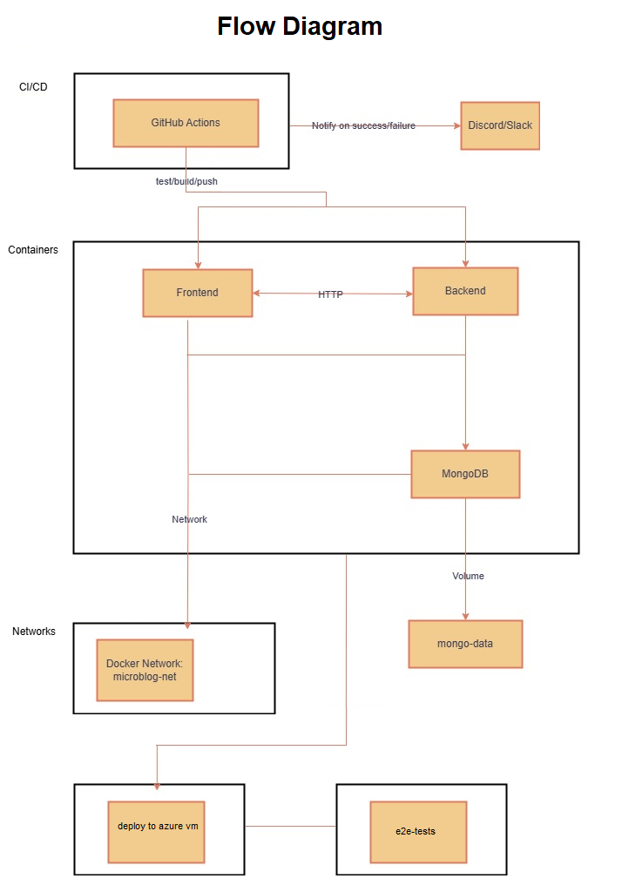
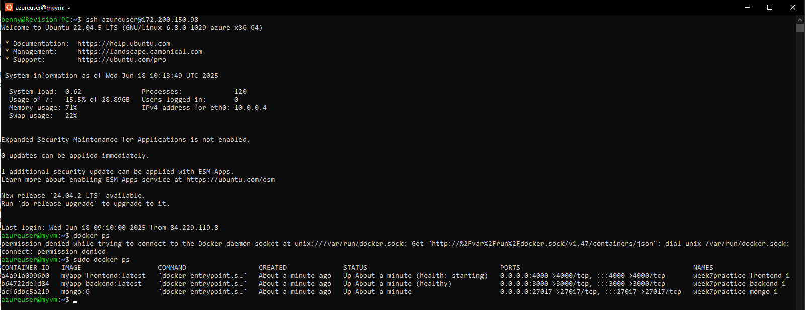

### this week 8 is built on top of week 7 which is build on top of week 6 which is build on top of week 5:

<details>
<summary> # week5-ci-cd </summary>

# Benny &amp; Avichai - week 5 collaboration


## Microblog Project

### A simple microblog project to demonstrate CI/CD using GitHub Actions.

### Backend (https://week5-ci-cd.onrender.com)

### Frontend (https://week5-ci-cd.vercel.app/)

### GitHub Actions (Runs backend and frontend tasks separately on every push/pull request.)


<hr>

## Introduction to GitHub Actions

- **What is a GitHub Action?**  
  A GitHub Action is an automated workflow step or script that runs in response to events (like code pushes, pull requests, or issues). It’s used for tasks like building, testing, and deploying the application.

- **What is the difference between a job and a step?**  
  - A **job** is a set of steps that run on the same runner (virtual machine). Jobs run in parallel by default, we can use 'needs' within a job to wait for other job to finish.
  - A **step** is a single task within a job (like `npm install` or `echo "Hello"`). Steps run sequentially within a job.

- **What triggers a workflow?**  
  Workflows are triggered by events (like `push`, `pull_request`, `workflow_dispatch`), a schedule (cron), or manually from the GitHub Actions UI.

---

## CI/CD Flowchart:  
 

---
## Basic CI Pipeline for Testing
1. In the project’s root, creating a new folder `.github/workflows`.  
2. Inside `.github/workflows`, create a file named `ci.yml`.  
3. Heres the basic template we started with for a Node.js app:

```yaml
name: CI Pipeline

on: # Runs on every push and pull request
  push:
  pull_request:

jobs:
  test:
    runs-on: ubuntu-latest
    steps:
      - uses: actions/checkout@v3
      - name: Set up Node.js
        uses: actions/setup-node@v3
        with:
          node-version: '18'
      - run: npm install # Installs dependencies
      - run: npm test # Runs test script
```

---

## Matrix Strategy
1. modifying the `ci.yml` file to include a matrix strategy:  

```yaml
    strategy:
      matrix: # Defines a matrix for versions
        node-version: [16, 18, 20]

    steps:
        with:
          node-version: ${{ matrix.node-version }}
```

we can confirm the workflow runs once for each version by checking the 'GitHub Actions' run results.  
for example in our case:  
https://github.com/Benny902/week5-ci-cd/actions/runs/15439997140

 
---

## Artifacts and Post-job Monitoring

In the **backend job**, we add a step to upload the test log file as an artifact:  

```yaml
- name: Upload test results
  uses: actions/upload-artifact@v4
  with:
    name: backend-test-results-node${{ matrix.node-version }}
    path: backend/test-results.log
```
we can download an artifact zip file from the link above, and see it has 'test-results.log' file inside of it, which shows:

 

---

## GitHub Secrets
### In our repository - > Settings -> Actions -> New repository Secret.

 
---

## Slack/Discord Integration
1. Integrate the workflow with Slack and Discord (we did both)
2. Store the webhook URL in the GitHub repo secrets (`SLACK_WEBHOOK_URL` and `DISCORD_WEBHOOK_URL`).  
3. Add both Discord and Slack notification step to the workflow (for backend and frontend accordingly):  

```yaml
      - name: Notify Slack (Backend)
        if: always() # always run this step even if tests fail
        uses: slackapi/slack-github-action@v1.25.0 # Use official Slack GitHub Action
        with:
          payload: |
            {
              "text": "*Job:* Backend (Node.js ${{ matrix.node-version }})\n*Status:* ${{ job.status }}\n*Duration:* ${{ env.JOB_DURATION }} seconds\n*Workflow:* ${{ github.workflow }}\n*Run:* #${{ github.run_number }}\n*Repo:* ${{ github.repository }}"
            }
        env:
          SLACK_WEBHOOK_URL: ${{ secrets.SLACK_WEBHOOK_URL }} # Slack webhook URL stored in GitHub secrets

      - name: Notify Discord (Backend) # here we use a different method, we use POST to the DISCORD_WEBHOOK_URL, because there is no official GitHub Action for Discord
        if: always() # always run this step even if tests fail
        run: |
          STATUS="Failed"
          if [ "${{ job.status }}" == "success" ]; then
            STATUS="Succeeded"
          fi

          curl -H "Content-Type: application/json" \
              -X POST \
              -d "{\"content\": \"*Job:* Backend (Node.js ${{ matrix.node-version }})\n*Status:* ${{ job.status }}\n*Duration:* ${{ env.JOB_DURATION }} seconds\n*Workflow:* ${{ github.workflow }}\n*Run:* #${{ github.run_number }}\n*Repo:* ${{ github.repository }}\"}" \
              ${{ secrets.DISCORD_WEBHOOK_URL }}
```
Screenshot of the outcome:   
Slack:  
 

Discord:  
 

---
## Used cache to improve performance:
```yaml
  - name: Set up Node.js
    uses: actions/setup-node@v3
    with:
        node-version: ${{ matrix.node-version }}
        cache: 'npm'
        cache-dependency-path: backend/package-lock.json

```
- `actions/setup-node@v3` automatically enables caching of the ~/.npm directory (where npm stores downloaded packages).
- `node-version:` ensures the cache is scoped per Node.js version — different versions create different caches.
- `cache: 'npm'` activates built-in npm dependency caching (no need for manual restore/save steps).
- `cache-dependency-path:` defines which file (here backend/package-lock.json) is hashed to generate the cache key — if this file changes, a new cache is created.

---

## Used linter tool (ESLint):
```yaml
      - name: Install ESLint
        run: npm install -g eslint

      - name: Run ESLint
        run: npx eslint .
        working-directory: backend
```
We use ESLint to enforce code quality.  
It checks .js files for missing semicolons (error), unused variables (warn), and allows console statements (e.g console.log).  
The rules are defined in a config file (eslint.config.js) and executed with npx `eslint .` .  

---

## Deployement steps:
```yaml
  backend:
    steps:
      - name: Trigger backend deploy on Render
        if: github.event_name == 'workflow_dispatch' || (github.event_name == 'push' && github.ref == 'refs/heads/main')
        run: curl -X POST ${{ secrets.RENDER_DEPLOY_HOOK_URL }}

  frontend:
    steps:
      - name: Mock Deploy Frontend (Vercel)
        if: github.event_name == 'workflow_dispatch' || (github.event_name == 'push' && github.ref == 'refs/heads/main')
        run: echo "Frontend automatically deployed by Vercel"
```
both render and vercel deploy automatically, but we wanted to show the difference and the possibility to deploy manualy, as we can see here on the Render deploy we use 'RENDER_DEPLOY_HOOK_URL' and deploy manually, but on the Vercel deploy we just display an echo because it deploys automatically after every push to the main.  
`if: github.event_name == 'workflow_dispatch' || (github.event_name == 'push' && github.ref == 'refs/heads/main')`: means it will only activate those deploys if its push in main, or clicked manually in the github actions (workflow_dispatch)

---


## Combined Frontend and Backend CI/CD (`Full cicd.yml` file):

<details>
<summary> Created simple backend and frontend folder and files and enhanced the yml, this is the final yml file: </summary>

```yaml
name: Microblog CI

on:
  push: # Runs on every push
  pull_request: # Runs on pull request
  workflow_dispatch: # Can be run manually

jobs:

  backend:
    runs-on: ubuntu-latest
    strategy:
      matrix: # Matrix strategy to test multiple Node.js versions
        node-version: [16, 18, 20]

    steps:
      - uses: actions/checkout@v3

      - name: Set job start time
        run: echo "JOB_START_TIME=$(date +%s)" >> $GITHUB_ENV # Record the start time in seconds and store it in GitHub Actions environment variable

      - name: Set up Node.js
        uses: actions/setup-node@v3
        with:
          node-version: ${{ matrix.node-version }} # Use the Node.js version from the matrix
          cache: 'npm'
          cache-dependency-path: backend/package-lock.json

      - name: Install backend dependencies
        run: |
          if [ "${{ matrix.node-version }}" < "18" ] ; then
            npm install
          else
            npm ci
          fi
        working-directory: backend

      - name: Install ESLint
        run: npm install -g eslint

      - name: Run ESLint
        run: npx eslint .
        working-directory: backend

      - name: Run backend tests
        run: |
          npm test | tee test-results.log
          echo "Build finished successfully at $(date)" >> test-results.log
        working-directory: backend

      - name: Upload test results
        uses: actions/upload-artifact@v4
        with:
          name: backend-test-results-node${{ matrix.node-version }}
          path: backend/test-results.log

      - name: Calculate job duration
        run: echo "JOB_DURATION=$(( $(date +%s) - $JOB_START_TIME ))" >> $GITHUB_ENV # Calculate duration in seconds and store in environment variable

      - name: Notify Slack (Backend)
        if: always() # always run this step even if tests fail
        uses: slackapi/slack-github-action@v1.25.0 # Use official Slack GitHub Action
        with:
          payload: |
            {
              "text": "*Job:* Backend (Node.js ${{ matrix.node-version }})\n*Status:* ${{ job.status }}\n*Duration:* ${{ env.JOB_DURATION }} seconds\n*Workflow:* ${{ github.workflow }}\n*Run:* #${{ github.run_number }}\n*Repo:* ${{ github.repository }}"
            }
        env:
          SLACK_WEBHOOK_URL: ${{ secrets.SLACK_WEBHOOK_URL }} # Slack webhook URL stored in GitHub secrets

      - name: Notify Discord (Backend) # here we use a different method, we use POST to the DISCORD_WEBHOOK_URL, because there is no official GitHub Action for Discord
        if: always() # always run this step even if tests fail
        run: |
          STATUS="Failed"
          if [ "${{ job.status }}" == "success" ]; then
            STATUS="Succeeded"
          fi

          curl -H "Content-Type: application/json" \
              -X POST \
              -d "{\"content\": \"*Job:* Backend (Node.js ${{ matrix.node-version }})\n*Status:* ${{ job.status }}\n*Duration:* ${{ env.JOB_DURATION }} seconds\n*Workflow:* ${{ github.workflow }}\n*Run:* #${{ github.run_number }}\n*Repo:* ${{ github.repository }}\"}" \
              ${{ secrets.DISCORD_WEBHOOK_URL }}

      - name: Trigger backend deploy on Render
        if: github.event_name == 'workflow_dispatch' || (github.event_name == 'push' && github.ref == 'refs/heads/main')
        run: curl -X POST ${{ secrets.RENDER_DEPLOY_HOOK_URL }}

      - name: Echo job completion
        if: success() # Only run if job was successful
        run: echo "Backend job for Node.js ${{ matrix.node-version }} completed successfully!" # Bash echo to log success message


  frontend:
    runs-on: ubuntu-latest
    strategy:
      matrix:
        node-version: [16, 18, 20]

    steps:
      - uses: actions/checkout@v3

      - name: Set job start time
        run: echo "JOB_START_TIME=$(date +%s)" >> $GITHUB_ENV # Record the job start time

      - name: Set up Node.js
        uses: actions/setup-node@v3
        with:
          node-version: ${{ matrix.node-version }} # Use matrix version
          cache: 'npm'
          cache-dependency-path: frontend/package-lock.json

      - name: Install frontend dependencies
        run: |
          if [ "${{ matrix.node-version }}" < "18" ] ; then
            npm install
          else
            npm ci
          fi
        working-directory: frontend

      - name: Install ESLint
        run: npm install -g eslint

      - name: Run ESLint
        run: npx eslint .
        working-directory: frontend

      - name: Serve frontend for testing # Start a local server and check if it's running
        run: |
          node server.js &
          sleep 3
          curl -I http://localhost:4000
        working-directory: frontend

      - name: Calculate job duration
        run: echo "JOB_DURATION=$(( $(date +%s) - $JOB_START_TIME ))" >> $GITHUB_ENV # Calculate how long the job took

      - name: Notify Slack (Frontend)
        if: always() # Always send Slack message
        uses: slackapi/slack-github-action@v1.25.0
        with:
          payload: |
            {
              "text": "*Job:* Frontend (Node.js ${{ matrix.node-version }})\n*Status:* ${{ job.status }}\n*Duration:* ${{ env.JOB_DURATION }} seconds\n*Workflow:* ${{ github.workflow }}\n*Run:* #${{ github.run_number }}\n*Repo:* ${{ github.repository }}"
            }
        env:
          SLACK_WEBHOOK_URL: ${{ secrets.SLACK_WEBHOOK_URL }}

      - name: Notify Discord
        if: always()
        run: |
          STATUS="Failed"
          if [ "${{ job.status }}" == "success" ]; then
            STATUS="Succeeded"
          fi

          curl -H "Content-Type: application/json" \
              -X POST \
              -d "{\"content\": \"*Job:* Frontend (Node.js ${{ matrix.node-version }})\n*Status:* ${{ job.status }}\n*Duration:* ${{ env.JOB_DURATION }} seconds\n*Workflow:* ${{ github.workflow }}\n*Run:* #${{ github.run_number }}\n*Repo:* ${{ github.repository }}\"}" \
              ${{ secrets.DISCORD_WEBHOOK_URL }}

      - name: Mock Deploy Frontend (Vercel)
        if: github.event_name == 'workflow_dispatch' || (github.event_name == 'push' && github.ref == 'refs/heads/main')
        run: echo "Frontend automatically deployed by Vercel"

      - name: Echo job completion
        if: success()
        run: echo "Frontend job for Node.js ${{ matrix.node-version }} completed successfully!" # Echo final success message for the job
```

</details>


<br><hr><br>

# REFLECTION.MD

## Learned:
We learned how to create a full CI/CD pipeline using GitHub Actions, including build, lint, test, artifact upload, and notifications. We used matrix builds to test across multiple Node.js versions and added caching for faster installs.

## Challenges:
The main challenge was restricting deployment to only run on pushes to main or manual triggers.  
We also had to manage step ordering and handle conditional logic within matrix jobs.

### we solved the deploy restriction by:  
 `github.event_name == 'workflow_dispatch' || (github.event_name == 'push' && github.ref == 'refs/heads/main')`  
 which means it will only activate those deploys if its push in main, or clicked manually in the github actions (workflow_dispatch)

### we solved the matrix issue by:  
 ```yaml
          if [ "${{ matrix.node-version }}" < "18" ] ; then
            npm install
          else
            npm ci
          fi
 ```
which means if the node is under 18 it will use `npm install` and if its 18 or higher it will use `npm ci`

- npm install installs dependencies listed in package.json, and may update package-lock.json.
- npm ci strictly installs from package-lock.json, is faster, and ensures a clean, reproducible install — ideal for CI pipelines.

## Improvements:
For a production pipeline, we would add test coverage checks, separate deploys for staging and production, and include security scans. Reusable workflows would also help reduce duplication and improve maintainability.

</details>
<hr>

<details>
<summary> # Week 6 – Summary Task: Docker & Containerization </summary>


## Overview

This week, we continued our DevOps project by fully containerizing the microblog application with Docker, orchestrating multi-container environments using Docker Compose, and integrating a CI/CD pipeline with GitHub Actions for the build images and push.  
The solution demonstrates containerization best practices, automated build/test/deploy flows, and team collaboration.

---

## 1. Application Architecture & Flow Diagram

The application consists of three main containers:

- **Frontend**: Node.js + Express static server (serves the UI)
- **Backend**: Node.js + Express REST API (handles blog data)
- **Database**: MongoDB container with persistent Docker volume

All containers communicate on a custom Docker network. The backend talks to MongoDB via the network, while the frontend interacts with the backend over HTTP.

**CI/CD** is managed by GitHub Actions: it builds images, runs tests, tags images, and deploys on push to main.

### Application Flow Diagram


---

## 2. Dockerization

Each service (frontend, backend) has a `Dockerfile`:

**Example `Dockerfile` for Backend:**
```dockerfile
# Use a lightweight Node.js image
FROM node:18-alpine

# Set working directory
WORKDIR /app

# Copy package.json and install dependencies
COPY package*.json ./
RUN npm install

# Copy all files
COPY . .

HEALTHCHECK --interval=30s --timeout=5s --retries=3 CMD curl -f http://localhost:3000/ || exit 1

# Run the server
CMD ["node", "server.js"]
```

### also added `.dockerignore`:
```
node_modules
.env
```
#### How `.dockerignore` affects build context:  
This will prevent the node_modules and .env files from being copied into the Docker image.  
- This reduces build context size (making builds faster).  
- `node_modules`: It ensures Docker installs fresh dependencies inside the container, avoiding possible OS or version conflicts.  
- keep sensitive files (like .env) out of production image.


## 3. Docker Compose & Networking
The project uses a single docker-compose.yml file to orchestrate all containers.

- Defines frontend, backend, and mongo services

- Connects all containers to the same custom network (microblog-net)

- Mounts a volume for MongoDB data (mongo-data)

### our `docker-compose.yml`:
```yml
version: '3.8'

services:
  mongo:
    image: mongo:6
    ports:
      - "27017:27017"
    volumes:
      - mongo-data:/data/db
    networks:
      - microblog-net

  backend:
    build: ./backend
    image: myapp-backend:${APP_VERSION:-latest}
    ports:
      - "3000:3000"
    depends_on:
      - mongo
    environment:
      - MONGO_URL=mongodb://mongo:27017/microblog
    volumes:
      - ./backend:/app
    networks:
      - microblog-net

  frontend:
    build: ./frontend
    image: myapp-frontend:${APP_VERSION:-latest}
    ports:
      - "4000:4000"
    depends_on:
      - backend
    volumes:
      - ./frontend:/app
    networks:
      - microblog-net

volumes:
  mongo-data:

networks:
  microblog-net:
    driver: bridge
```

### To start everything (locally, and need to have docker installed):
```bash
docker-compose up --build
```

- Frontend: http://localhost:4000

- Backend API: http://localhost:3000

- MongoDB: mongodb://localhost:27017/microblog

## 4. Healthchecks & Image Tagging
#### HEALTHCHECK instructions are added in Dockerfiles for backend and frontend.
```dockerfile
HEALTHCHECK --interval=30s --timeout=5s --retries=3 CMD curl -f http://localhost:3000/ || exit 1
```

#### Images are tagged using Semantic Versioning (myapp-backend:1.0.0, myapp-frontend:1.0.0) when building and pushing via CI/CD.
- for example in local with docker-compose:
```yml
image: myapp-backend:${APP_VERSION:-latest}
```

- and in github actions (in deploy):
```yml
      - name: Build Docker image
        run: |
          docker build -t ${{ secrets.DOCKERHUB_USERNAME }}/myapp-backend:${{ inputs.tag }} ./backend

      - name: Push Docker image
        run: |
          docker push ${{ secrets.DOCKERHUB_USERNAME }}/myapp-backend:${{ inputs.tag }}
```
the tag is passed to the build file from the main cicd file using `with: tag: ${{ github.ref_name }}`:
```yml
  backend-docker-build:
    needs: backend-test
    uses: ./.github/workflows/docker-build-backend.yml
    with:
      tag: ${{ github.ref_name }}
    secrets: inherit
```

## 5. GitHub Actions CI/CD
### The pipeline does the following on each push and PR:

- Installs dependencies

- Runs lint and tests

- Builds Docker images with semantic version tags (derived from Git tags like v1.0.0)

- Pushes images to Docker Hub (requires secrets)

- Deploys (via Render/Vercel backend/frontend)

- Notifies Slack and Discord with build/test status (always runs notifications, even on failure!)

### Simplified pipeline into Reusable workflows that also help reduce duplication and improve maintainability:
### main `cicd.yml` file:
```yml
name: Microblog CICD

on:
  push: # Runs on every push
      tags:
      - 'v*.*.*'
  pull_request: # Runs on pull request
  workflow_dispatch: # Can be run manually

jobs:

  backend-test:
    uses: ./.github/workflows/backend-test.yml

  backend-docker-build:
    needs: backend-test
    uses: ./.github/workflows/docker-build-backend.yml
    with:
      tag: ${{ github.ref_name }}
    secrets: inherit

  backend-notify:
    needs: [backend-test, backend-docker-build]
    if: always()
    uses: ./.github/workflows/notify-backend.yml
    with:
      job_start_time: ${{ needs.backend-test.outputs.job_start_time }}
      test_status: ${{ needs.backend-test.result }}
      build_status: ${{ needs.backend-docker-build.result }}
    secrets: inherit

  frontend-test:
    uses: ./.github/workflows/frontend-test.yml

  frontend-docker-build:
    needs: frontend-test
    uses: ./.github/workflows/docker-build-frontend.yml
    with:
      tag: ${{ github.ref_name }}
    secrets: inherit

  frontend-notify:
    needs: [frontend-test, frontend-docker-build]
    if: always()
    uses: ./.github/workflows/notify-frontend.yml
    with:
      job_start_time: ${{ needs.frontend-test.outputs.job_start_time }}
      test_status: ${{ needs.frontend-test.result }}
      build_status: ${{ needs.frontend-docker-build.result }}
    secrets: inherit
```

</details>

<hr>

<details>
<summary> # Benny & Yosef - week 7 collab </summary>

# week 7 - Docker Compose & Azure + VM:

## Flowchart:  
 

## Create and Run Multi-Container App with Docker Compose and healthchecks and everything:
Already done in previous week.


## Azure VM Setup and Manual Deployment
this is similar to week3:

### Generate the SSH key:
```bash
ssh-keygen -t rsa -b 2048 -f ~/.ssh/id_rsa
```
and then presse 'enter' to accept the file location.  
and again press 'enter' two times to skip setting passphrase.

### Script to create an Azure Linux VM and Add this public key to the VM
```bash
#!/bin/bash

# Set variables
RESOURCE_GROUP="bennyVMeastus2"
LOCATION="eastus2" # cheapest for Standard_B1ls as i saw in pricing
VM_NAME="myvm"
ADMIN_USER="azureuser"

# Create resource group
az group create --name "$RESOURCE_GROUP" --location "$LOCATION"

# Create VM # Standard_B1ls is the cheapest.
az vm create \
  --resource-group "$RESOURCE_GROUP" \
  --name "$VM_NAME" \
  --image Ubuntu2204 \
  --size Standard_B1ls \
  --admin-username "$ADMIN_USER" \
  --authentication-type ssh \
  --generate-ssh-keys

# Add the public key to the VM (from ~/.ssh/id_rsa.pub)
az vm user update \
  --resource-group "$RESOURCE_GROUP" \
  --name "$VM_NAME" \
  --username "$ADMIN_USER" \
  --ssh-key-value "$(cat ~/.ssh/id_rsa.pub)"

# Open SSH port 22 (if not already open)
az vm open-port --port 22 --resource-group "$RESOURCE_GROUP" --name "$VM_NAME"
```

### Run the Script:
```bash
chmod +x create_vm_and_add_public_key.sh
./create_vm_and_add_public_key.sh
```

### Get the public IP of the VM with this command:
```bash
az vm show \
  --resource-group bennyVMeastus2 \
  --name myvm \
  -d \
  --query publicIps \
  -o tsv
```

### Connect to the Azure VM without password:
```bash
ssh azureuser@<vm-public-ip>
```

### Install Docker & Docker Compose
```bash
# Update package info
sudo apt update

# Install Docker
sudo apt install -y docker.io

# Enable and start Docker
sudo systemctl enable docker
sudo systemctl start docker

# Install Docker Compose
sudo apt install -y docker-compose
```


### Copy The Project Files to the VM
(go back to local machine with `exit`) : On local machine, in the project folder
```bash
scp -i ~/.ssh/id_rsa -r ./* azureuser@<vm-public-ip>:/home/azureuser/week7practice
```


### Build and Run the App on the VM
connect to the vm again ( ssh azureuser@<vm-public-ip> ) and then:
```bash
cd ~/week7practice
sudo docker-compose up -d --build
```

### This failed in my case i was because i was using 'cheap' VM with only 344mb, therfore i added `Swap`:
- Swap gives you virtual memory using disk. It’s not as fast as RAM, but prevents OOM crashes.
- Run these commands on the VM:
```bash
# Create a 1GB swap file
sudo fallocate -l 1G /swapfile
sudo chmod 600 /swapfile

# Set up the swap space
sudo mkswap /swapfile

# Enable swap
sudo swapon /swapfile

# Make it persistent (so it works after reboot)
echo '/swapfile none swap sw 0 0' | sudo tee -a /etc/fstab

# Check result # should see 'Swap:   1.0G   0B   1.0G'
free -h
```

### Expose Public Ports (Backend: 3000, Frontend: 4000)
- go back to our local (`exit`)
```bash
az vm open-port --port 3000 --resource-group bennyVMeastus2 --name myvm --priority 902
az vm open-port --port 4000 --resource-group bennyVMeastus2 --name myvm --priority 903
```
- when tried without `--priority` i had conflict.
- Each rule must have a unique priority (between 100 and 4096, lower number = higher priority).

### Verify Application is Running

- Backend: http://<vm-public-ip>:3000   

- Frontend: http://<vm-public-ip>:4000   

- To check logs or health:
```bash
sudo docker ps
sudo docker-compose logs --tail=50
```


## Deploy to Azure VM via CI/CD (GitHub Actions)

### we start by Adding repository secrets in GitHub:
(Settings > Secrets and variables > Actions):  
- VM_HOST → azureuser@<vm-public-ip>
- VM_SSH_KEY → Contents of the private ~/.ssh/id_rsa file (not the .pub!)


## Create the Workflow File
`deploy-vm.yml`:
```yml
name: Deploy to Azure VM

on:
  workflow_dispatch:
  push:
    branches:
      - main

jobs:
  deploy-vm:
    runs-on: ubuntu-latest
    steps:
      - name: Checkout code
        uses: actions/checkout@v3

      - name: Write SSH key
        run: |
          echo "${{ secrets.VM_SSH_KEY }}" > key.pem
          chmod 600 key.pem

      - name: Copy files to VM with rsync
        run: |
          rsync -az --delete --exclude='.git' --exclude='node_modules' -e "ssh -i key.pem -o StrictHostKeyChecking=no" ./ ${{ secrets.VM_HOST }}:/home/azureuser/week7practice

      - name: Deploy with docker-compose
        run: |
          ssh -i key.pem -o StrictHostKeyChecking=no ${{ secrets.VM_HOST }} "
            cd /home/azureuser/week7practice &&
            sudo docker-compose down --remove-orphans &&
            sudo docker-compose up -d --build
          "

      - name: Healthcheck and get logs
        run: |
          ssh -i key.pem -o StrictHostKeyChecking=no ${{ secrets.VM_HOST }} "
            sudo docker-compose ps
            sudo docker-compose logs --tail=50
          " > remote_logs.txt

      - name: Upload VM logs
        uses: actions/upload-artifact@v4
        with:
          name: remote-logs
          path: remote_logs.txt

      - name: Cleanup key
        run: rm key.pem
```


and now we can see that the containers are running in the azure:
 

---

</details>

<hr>
<br><br><br>

# WEEK 8 – Summary Task: Azure Infrastructure

## This week includes only the addition steps (on top of week 7) required for Week 8 Summary Task:

## Flowchart:  
 

### GitHubSecrets Required (Settings > Secrets and variables > Actions): 
in addition the the secrets we had from week 7:
- VM_HOST → azureuser@<vm-public-ip>
- VM_SSH_KEY → Contents of the private ~/.ssh/id_rsa file (not the .pub!)

we will add one more secret: 
- AZURE_CREDENTIALS → A service principal in JSON format to allow azure/login

Create with:
```bash
az ad sp create-for-rbac --name "gh-actions" --sdk-auth
```
- copy the entire json output into the `AZURE_CREDENTIALS` secret
 

### new `post-deploy-week8.yml` file for week 8 additions:
- Get Public IP Name
- Make IP Static
- Get VM Public IP
- Run Initial Healthcheck

```bash
name: Week 8 Post-Deploy Tasks

on:
  workflow_call:
    outputs:
      ip_status:
        description: "Was the IP made static successfully?"
        value: ${{ jobs.week8_post_deploy.outputs.ip_status }}

jobs:
  week8_post_deploy:
    runs-on: ubuntu-latest
    outputs:
      ip_status: ${{ steps.recheck.outcome }}

    steps:
      - name: Checkout Repo
        uses: actions/checkout@v3

      - name: Azure Login
        uses: azure/login@v1
        with:
          creds: ${{ secrets.AZURE_CREDENTIALS }}

      - name: Get Public IP Name
        id: get_ip_name
        run: |
          IP_NAME=$(az network public-ip list \
            --resource-group bennyVMeastus2 \
            --query "[0].name" -o tsv)
          echo "IP_NAME=$IP_NAME" >> $GITHUB_ENV

      - name: Make IP Static
        run: |
          az network public-ip update \
            --resource-group bennyVMeastus2 \
            --name "$IP_NAME" \
            --allocation-method Static

      - name: Get VM Public IP
        id: get_vm_ip
        run: |
          VM_IP=$(az vm show -d -g bennyVMeastus2 -n myvm --query publicIps -o tsv)
          echo "VM_IP=$VM_IP" >> $GITHUB_ENV

      - name: Run Initial Healthcheck
        run: |
          echo "Checking http://$VM_IP:3000..." > healthcheck.log
          if curl --fail --silent http://$VM_IP:3000; then
            echo "Initial health check passed" >> healthcheck.log
          else
            echo "Initial health check failed" >> healthcheck.log
            exit 1
          fi
```

### Update main file `cicd.yml` with this file addition:
```bash
  post-deploy-week8:
    needs: deploy-to-azure-vm
    uses: ./.github/workflows/post-deploy-week8.yml
    secrets: inherit
```

---

## Create and Attach a P1 Disk
`create-disk.yml`:
```bash
name: Attach P1 Disk

on:
  workflow_dispatch:

jobs:
  attach-p1-disk:
    runs-on: ubuntu-latest

    steps:
      - name: Login to Azure
        uses: azure/login@v1
        with:
          creds: ${{ secrets.AZURE_CREDENTIALS }}

      - name: Create and Attach P1 Premium SSD
        run: |
          RESOURCE_GROUP="bennyVMeastus2"
          VM_NAME="myvm"
          LOCATION="eastus2"
          DISK_NAME="myP1Disk"

          echo "Creating 4 GiB P1 Premium SSD ($DISK_NAME)..."
          az disk create \
            --resource-group "$RESOURCE_GROUP" \
            --name "$DISK_NAME" \
            --sku Premium_LRS \
            --tier P1 \
            --size-gb 4 \
            --location "$LOCATION"

          echo "Attaching $DISK_NAME to $VM_NAME..."
          az vm disk attach \
            --resource-group "$RESOURCE_GROUP" \
            --vm-name "$VM_NAME" \
            --name "$DISK_NAME"
```

### Update main file `cicd.yml` with this file addition:
```bash
  create-and-attach-disk:
    needs: deploy-to-azure-vm
    uses: ./.github/workflows/create-disk.yml
    secrets: inherit
```

---

## Deployment Log
### deployment-log.yml – Generate deployment_log.md:
capture actual steps during the deployment and then write them into `deployment_log.md` file in the repo
```bash
name: Write Deployment Log

on:
  workflow_dispatch:
  workflow_call:

jobs:
  log:
    runs-on: ubuntu-latest

    steps:
      - name: Checkout repo
        uses: actions/checkout@v3

      - name: Azure Login
        uses: azure/login@v1
        with:
          creds: ${{ secrets.AZURE_CREDENTIALS }}

      - name: Get VM Public IP
        id: get_ip
        run: |
          VM_IP=$(az vm show -d -g bennyVMeastus2 -n myvm --query publicIps -o tsv)
          echo "VM_IP=$VM_IP" >> $GITHUB_ENV

      - name: Create deployment_log.md
        run: |
          TIMESTAMP=$(date +"%Y-%m-%d %H:%M:%S")
          cat <<EOF > deployment_log.md
          # Week 8 Deployment Log

          ## Timestamp
          $TIMESTAMP

          ## Public IP
          $VM_IP

          ## Azure CLI Commands

          - az login --use-device-code
          - az account set --subscription ...
          - az group create --name bennyVMeastus2 --location eastus2
          - az vm create --resource-group bennyVMeastus2 --name myvm ...
          - az network public-ip update --allocation-method Static
          - az vm open-port --port 22 ...
          - scp ./ to VM
          - docker-compose up -d

          ## Deployment Method
          - GitHub Actions CI/CD (via deploy-vm.yml)

          ## Healthcheck
          - curl http://$VM_IP:3000

          ## Reboot Test
          - App recovered after reboot

          ## Browser Compatibility
          - Chrome
          - Firefox
          - Mobile
          EOF

      - name: Commit and push deployment_log.md
        run: |
          git config --global user.name "gh-actions"
          git config --global user.email "github-actions@users.noreply.github.com"
          git add deployment_log.md
          git commit -m "Add deployment_log.md [skip ci]" || echo "No changes to commit"
          git push origin HEAD
```

### Update main file `cicd.yml` with this file addition:
```bash
  write-deployment-log:
    needs: post-deploy-week8
    uses: ./.github/workflows/write-deployment-log.yml
    secrets: inherit
```

---

## reboot-check.yml – Reboot VM and Check App Health
### This workflow reboots the VM via SSH, waits, then checks if the app is reachable via curl
`reboot-check.yml`, it is not run automaticaly in the cicd, it can be run individualy in the github actions:
```bash
name: Reboot and Healthcheck

on:
  workflow_dispatch:

jobs:
  reboot-test:
    runs-on: ubuntu-latest

    steps:
      - name: Get VM IP (via Azure CLI)
        uses: azure/login@v1
        with:
          creds: ${{ secrets.AZURE_CREDENTIALS }}

      - name: Get Public IP
        id: get_ip
        run: |
          VM_IP=$(az vm show -d -g bennyVMeastus2 -n myvm --query publicIps -o tsv)
          echo "VM_IP=$VM_IP" >> $GITHUB_ENV

      - name: Reboot VM via SSH
        run: |
          ssh -i ~/.ssh/id_rsa -o StrictHostKeyChecking=no ${{ secrets.VM_HOST }} "sudo reboot" || true
          echo "Waiting 90s for reboot..."
          sleep 90

      - name: Health Check After Reboot
        run: |
          echo "Rechecking app at http://$VM_IP:3000" > reboot-healthcheck.log
          if curl --fail --silent http://$VM_IP:3000; then
            echo "App came back online" >> reboot-healthcheck.log
          else
            echo "App failed after reboot" >> reboot-healthcheck.log
            exit 1
          fi

      - name: Upload Healthcheck Result
        uses: actions/upload-artifact@v4
        with:
          name: reboot-healthcheck-log
          path: reboot-healthcheck.log
```